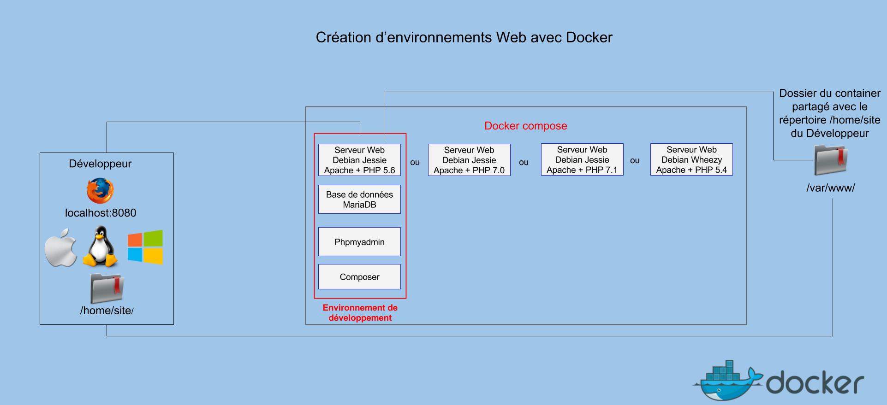
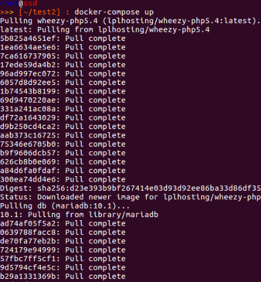
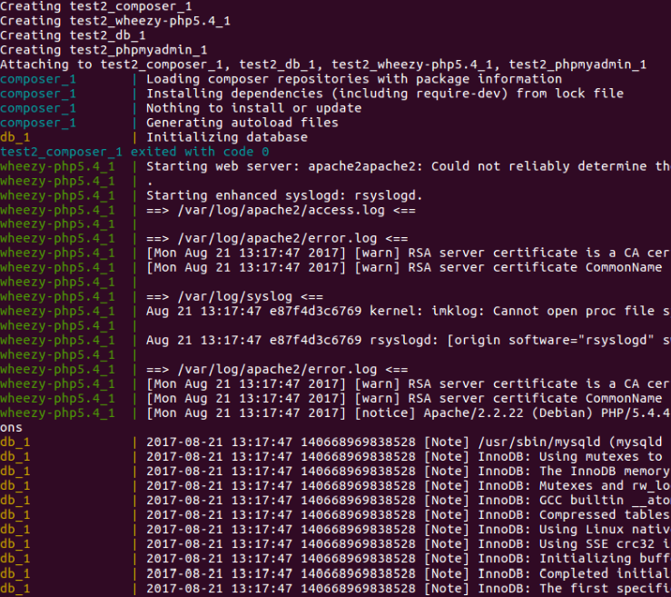
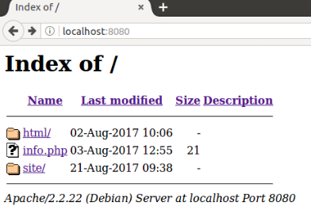
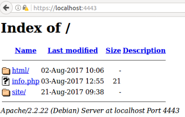

Documentation Technique  
***********************

Cette documentation a été rédigée pour utiliser les environnements de développements web créés avec Docker. Cette solution permet de développer des sites web en utilisant la même plateforme de développement.

.. toctree::
   :maxdepth: 2
   :caption: Contents:

Ce document permet de lancer un environnement de développement composé de containers :

	- Apache + PHP 5.4 ( ou PHP 5.6 , PHP 7.0 , PHP 7.1) 
	- MariaDB 
	- Phpmyadmin
	- Composer

Prérequis :

	- Docker doit être installé sur le système hôte .
	- Une connexion Internet pour pouvoir récupérer les images en ligne.
	- Créer un répertoire ( /votre/répertoire/web ) qui contiendra les fichiers du site.
	  Ce répertoire sera partagé avec le container du serveur web.

Lancement d’un environnement de développement :
===============================================

Première étape : Création du docker-compose
-------------------------------------------
Il faut rédiger le fichier docker-compose.yml , ce fichier sert à lancer plusieurs containers en même temps.
Les containers peuvent communiquer entre eux car Docker créer un réseau privé qui relie les différents containers.

.. literalinclude:: _static/examplecompose.yaml

Le premier container utilise l’image wheezy-php5.4 qui est disponible sur le repo lpl-hosting dans le docker hub. Elle sera récupérée automatiquement lors du lancement des containers.

a) Définition des volumes et des variables d’environnements
"""""""""""""""""""""""""""""""""""""""""""""""""""""""""""
		
Il faut définir les volumes en remplaçant /your/web/directory/ par le répertoire précédemment créé sur le système hôte. Ensuite il faut définir les variables d’environnements  qui seront utilisées pour pouvoir envoyer des mails depuis le site. Il faut utiliser un serveur SMTP externe au container.

b) Configuration de la base de données
""""""""""""""""""""""""""""""""""""""

Le second container lance le service de base de données (Mariadb) , il faut préciser :  

	- le mot de passe de l’utilisateur « root »
	- un utilisateur de la base de donnée
	- le mot de passe associé à l’utilisateur
	- le nom de la base de données.

c) Configuration de composer
""""""""""""""""""""""""""""

Le quatrième container permet de gérer les dépendances PHP avec le service Composer.
Il faut créer un répertoire composer dans le dossier /your/web/directory/ du système hôte.
Dans ce répertoire il faut créer un fichier composer.json :

.. literalinclude:: _static/composer.json

Ce fichier est un exemple qui permet de déclarer les dépendances PHP du site web.

Une fois le fichier docker-compose.yml écrit il faut le sauvegarder dans un répertoire du système hôte.

Remarque : Pour pouvoir changer de serveur web et de version de PHP, il faut remplacer dans le fichier docker-compose.yml :

.. literalinclude:: _static/code1.yaml

par

.. literalinclude:: _static/code2.yaml

Deuxième étape : Lancement des containers
-----------------------------------------
Pour pouvoir lancer les containers il faut se placer dans le dossier qui contient le fichier docker-compose.yml et utiliser la commande :
::
	
	docker-compose up

   

Docker récupère les images depuis le docker hub et  lance les containers.

Troisième étape: Accès au site web
----------------------------------
Accès au site web à l’adresse: http://localhost:8080/

Le site est également accessible à l’adresse : https://localhost:4443/

Annexe :
========

Fichier utilisé pour créer l’image wheezy-php5.4 :
::

	### Image de base ###
	FROM debian:wheezy
	### Installation des paquets ###
	RUN echo "deb http://packages.dotdeb.org wheezy all" > 
	/etc/apt/sources.list.d/dotdeb.list
	RUN apt-get update && apt-get -y install wget
	RUN wget --no-check-certificate https://www.dotdeb.org/dotdeb.gpg && apt-key add dotdeb.gpg
	RUN apt-get update && apt-get -y install \
	apache2 \
	php5 \ 
	libapache2-mod-php5 \
	ca-certificates \
	php5-mysqlnd \
	php5-apcu \
	php5-cli \
	php5-common \ 
	php5-curl \ 
	php5-dev \   
	php5-gd \  
	php5-imagick \
	php5-intl \
	php5-json \
	php5-memcached \
	php5-mcrypt \ 
	php5-xsl \
	apache2-mpm-itk \
	ssmtp \
	rsyslog
	### Configuration d'Apache ###
	RUN rm /var/www/index.html && \
	mkdir /var/www/html/ /etc/apache2/ssl
	WORKDIR /etc/apache2/ssl
	### Configuration du certificat auto-signé ###
	RUN openssl genrsa -out apache.key 1024 && \
	openssl req -nodes -new -x509 -days 365 -key apache.key -out apache.crt -subj "/C=FR/ST=ex/L=ex/O=ex/OU=ex/CN=docker-localhost"
	### On ajoute le fichier info.php et le script apache.sh ###
	COPY info.php /var/www/
	COPY script.sh /
	COPY status.conf /etc/apache2/mods-available/
	COPY default /etc/apache2/sites-available/
	COPY default-ssl /etc/apache2/sites-available/
	COPY php.ini /etc/php5/apache2/
	COPY ssmtp.conf /etc/ssmtp/
	### Configuration du module mpm-itk ###
	RUN useradd -d /home/lpl -s /bin/bash lpl
	### Activation des modules d'Apache ###
	RUN a2enmod ssl status rewrite expires
	### Activation des vhosts ###
	RUN a2ensite  default-ssl
	### ON partage le repertoire .../html  du conteneur ###
	VOLUME ["[/var/www/html]"]
	### On lance le service apache2 ###
	CMD ["bash","/script.sh"]
